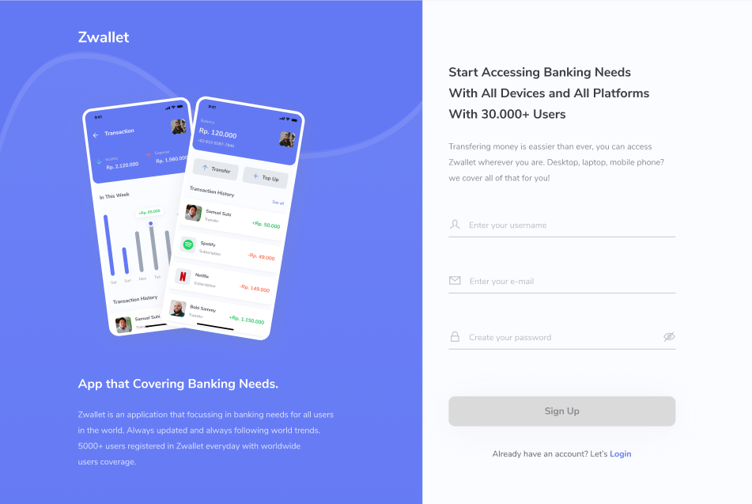

<p align="center">
  zWallet
</p>

---

## ✏️ About

Zwallet is a digital wallet application that simplifies your financial needs and can save a lot of time on your banking needs with just one application. Zwallet is in the field of digital banking, which is increasingly developing rapidly as technology advances. This application is able to save money, make transfers between users or top up balances.

## 🔖Build With

- NextJS
- Redux
- Bootstrap

## 💻 How To Install?

- Clone This Repo

```
git clone https://github.com/abudzr/zwallet-frontend.git
```

- Go To Folder Repo

```
cd zwallet-frontend
```

- Install Module

```
npm install
```

- Type ` npm start` To Start Website

## Screenshot

<p align="center">
  <span>
   
  </span>
</p>
